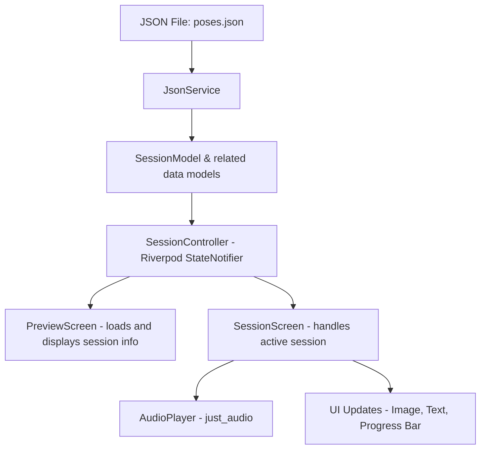

# 🧘‍♂️ Yoga Session App

A Flutter-based guided yoga session app.  
Plays synchronized audio and pose images based on a JSON sequence.  
Supports intro, looped breathing cycles, and outro — all dynamically loaded.

## ✨ Features
- 📄 JSON-driven session flow (easily add new poses)
- 🎵 Audio & image sync
- ⏯ Pause, resume, and restart steps
- 📊 Progress bar with timer
- 🎯 Loop handling with round tracking

## 🛠 Tech Stack
- Flutter
- Riverpod - state management
- just_audio - audio playback

## 📂 App Flow (Data Flow Diagram)

## 📸 Demo
*(Add screenshots or GIF later)*

---

**Note:** This is a POC (proof of concept) assignment for internship evaluation.
